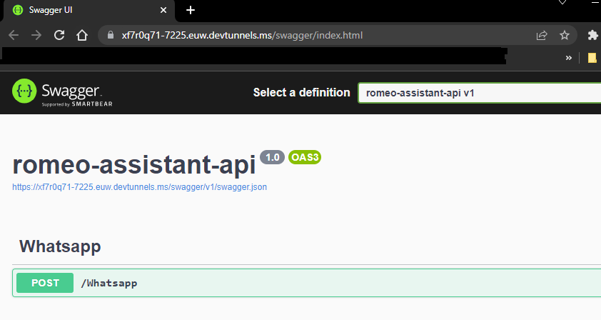

# .NET WhatsApp Bot with OpenAI GPT-3.5, Postgres and Maytapi

This .NET WhatsApp bot project utilizes [OpenAI's GPT-3.5](https://openai.com/blog/openai-api) model, [Postgres (Supabase)](https://supabase.com/) and the [Maytapi API](https://maytapi.com/). The bot is designed to provide automated, intelligent responses in WhatsApp group interactions.

The Maytapi API allows the bot to integrate with WhatsApp groups, while OpenAI's GPT-3.5 model enables the generation of context-aware text based on user input. All data handling and storage is managed through Supabase, providing a reliable database solution for the project.

# Table of Contents

1. [Meet Romeo](#meet-romeo)
2. [Features](#features)
3. [Setup](#setup)
    - [Prerequisites](#prerequisites)
        - [Visual Studio](#visual-studio)
        - [Maytapi account](#maytapi-account)
        - [OpenAI account](#openai-account)
        - [Supabase account](#supabase-account)
4. [Getting Started](#getting-start)
    - [Clone the repository](#clone-the-repository)
    - [Update configurations](#update-configurations)
    - [Create tables on Postgres (supabase)](#create-tables-on-postgres-supabase)
5. [Start Playing](#start-playing)
6. [Additional Project: Romeo Assistant Azure Functions](#additional-project-romeo-assistant-azure-functions)
    - [Enabling production mode](#enabling-production-mode)

# Meet Romeo


## Whatsapp Contact 


# Features

This bot is designed to work exclusively within WhatsApp groups. Once added to a group, it can be controlled with the following commands:

## !prompt

This command to guide the bot's behavior by suggesting a specific response or action.
 

## !active 

This command will make the bot respond to all messages in the group. This might lead to frequent bot responses.


## !passive 
This command will make the bot respond only when it is specifically mentioned in a message, thus being less intrusive.


## !tokens
This command to get a count of the remaining tokens before the bot's "memory" or context is reset. This helps you understand the bot's remaining capacity for remembering previous interactions.


## location
This is a specialized feature for the region of Mallorca. When used, the bot responds with the number of bicycles available near a specified GPS location.


# Setup

Here are the steps to set up the project on your local machine.

## Prerequisites

- Visual Studio  (version 17.5.4 or later)
- .NET Core SDK
- Maytapi account
- OpenAI account 
- Supabase account (Postgres)


### Visual Studio 

You will need [Visual Studio 17.5.4](https://visualstudio.microsoft.com/es/vs/) or later to utilize the [Dev Tunnels](https://learn.microsoft.com/en-us/connectors/custom-connectors/port-tunneling) feature, which allows you to access your local development server from anywhere on the internet. This is crucial for testing and development purposes.

### Maytapi account

[Maytapi](https://maytapi.com/whatsapp-api-documentation) is a crucial component of this project as it allows the bot to integrate seamlessly with WhatsApp. Maytapi provides an API for WhatsApp, enabling your application to send and receive messages, images, and other types of content directly through WhatsApp groups or individual conversations.

One of the reasons for choosing Maytapi over [Twilio](https://www.twilio.com/whatsapp), which also provides a WhatsApp Business API, is the ability of Maytapi to work directly with standard WhatsApp accounts. While Twilio's WhatsApp API is primarily designed for business accounts, [Maytapi's API](https://maytapi.com/whatsapp-api-documentation) allows our bot to function in any regular WhatsApp group, making it more versatile for different types of users and uses.

The cost of a Maytapi account is [$30](https://maytapi.com/whatsapp-api-pricing) per month. However, if you're not ready to commit to a paid plan just yet, Maytapi offers a 3-day trial period. This allows you to test out the service and see if it meets your project's needs before you decide to purchase a subscription.

> To utilize the Maytapi service for this project, it's crucial to have an available WhatsApp number that also has the capability to access WhatsApp Web. Maytapi's service operates by connecting to your WhatsApp account through WhatsApp Web, so this is an essential prerequisite. Make sure that the WhatsApp number you plan to use with Maytapi is set up and ready for WhatsApp Web usage.

> Once you have an active Maytapi account linked with a valid WhatsApp number , make sure to [copy the Product ID and the Token](https://console.maytapi.com/developers/token) and store them in a safe place for later use.

### OpenAI account 

In order to use the OpenAI's GPT-3.5 model for generating responses, [you'll need an OpenAI API account](https://platform.openai.com/account/api-keys). This API allows your bot to communicate with OpenAI's models and use them to generate text.

As of the current OpenAI pricing ($0.002 / 1K tokens), the cost to use the GPT-3.5 model is quite affordable. However, costs can vary based on the usage and specific pricing details can be found on the [OpenAI Pricing page](https://openai.com/pricing)

> Running the bot for one month has not cost me more than 5 dollars.

> Once you have an active OpenAPI account linked with a api key , make sure to [copy the secret key](https://platform.openai.com/account/api-keys) and store them in a safe place for later use.


### Supabase account

[Supabase](https://supabase.com/) is an open-source alternative to Firebase, providing a suite of tools and services that allows developers to create, manage, and scale modern web applications faster.

A significant advantage of Supabase is its free tier.
For this project, Supabase is an excellent fit because of its compatibility with Postgres, ease of use, real-time capabilities, and cost-effectiveness.

You will need to [create a database in supabase](https://supabase.com/docs/guides/database) to store whatsapp messages.

> Once you have an active Supabase account created with a database already settled , make sure to copy your [supabase url](https://supabase.com/docs/guides/database/connecting-to-postgres#connecting-with-ssl) and the [supabase api key](https://docs.draftbit.com/docs/supabase#get-the-restful-endpoint-and-project-api-key) and store them in a safe place for later use.


# Getting start


## Clone the repository

```bash 
git clone https://github.com/brunonuzzi/romeo-assistant.git
```
and open the romeo-assistant.sln on visual studio 17.5.4 or later

## Update configurations

You must update the [config.json](https://github.com/brunonuzzi/romeo-assistant.git) file on `/romeo-assistant-core/config.json`

Make sure to modify the following keys and save.

```json
"OpenAI": {
    "ApiKey": "__OPEN AI API KEY__"
  },
"Maytapi": {
        "ApiKey": "__MAY TAPI API KEY__",
        "ProductId": "__MAY TAPI PRODUCT ID__",
    }
"Supabase": {
        "Url": "__SUPA BASE DATABASE URL__",
        "Key": "SUPA BASE API KEY",
    } ,
"RomeoSetup": {
        "RomeoNumber": "__TELEPHONE NUMBER WITH CONTRY PREFIX__",
        "AzureFunctionsUrl": "__",
    }   
```

## Create tables on Postgres (supabase)

You must create the 3 tables responsible for managing all api messages in supabase.
The script creation of each one of the tables is here [database/schemas.sql](https://github.com/brunonuzzi/romeo-assistant/blob/master/database/schema.sql)

Just open the supabase sql editor and execute the [script](https://github.com/brunonuzzi/romeo-assistant/blob/master/database/schema.sql).


> **Very important**: You should remove the [rls feature](https://supabase.com/docs/guides/auth/row-level-security) for all the tables , otherwise the application will not work


## Start playing

Once you have:

1. The open ai account created and configured on config.json
2. The maytapi account created and configured on config.json
3. The supabase account created and configured on config.json
4. The tables created on supabase with rls removed
5. The project opened in visual studio with the dev tunnels feature enabled.

Choose the `romeo-assistant-api` and `Set as startup project`

The [Program.cs](https://github.com/brunonuzzi/romeo-assistant/blob/master/romeo-assistant/Program.cs) for the `romeo-assistant-api`  has an initialization configuration that will register your local url generated through the dev tunnel in the may tapi api.

> Make sure to have the [dev tunnels enabled](https://learn.microsoft.com/en-us/connectors/custom-connectors/port-tunneling).


```csharp
if (app.Environment.IsDevelopment())
{
    app.UseSwagger();
    app.UseSwaggerUI();
    app.UseMiddleware<LogRequestMiddleware>();

    // Resolve the IWhatsappService instance and call the RunOnce method
    using var serviceScope = app.Services.CreateScope();

    var serviceProvider = serviceScope.ServiceProvider;
    var whatsappService = serviceProvider.GetRequiredService<IWhatsappService>();
    var localUrl = $"{Environment.GetEnvironmentVariable("VS_TUNNEL_URL")}Whatsapp";
    whatsappService.ConfigureWebHook(localUrl);
}
```

[This is a webhook configuration](https://maytapi.com/whatsapp-api-documentation), which means that whenever a new message arrives to a whatsapp group where Romeo is registered, the url of your local environment will be called from maytapi to manage the incoming message.


### Hit the play

Start the application 


You should see the api ready to receive the incoming requests from maytapi.



### Making sure everything is working

- You could validate if your local webhook is properly configured on maytapi [over here](https://console.maytapi.com/developers/webhook)
- You also should see all the incoming messages through the console of your application


`Congrats !!! , your bot now is running locally.`

# Additional Project: Romeo Assistant Azure Functions

Within the solution, you'll find an additional project named ["romeo-assistant-az-functions"](https://github.com/brunonuzzi/romeo-assistant/tree/master/romeo-assistant-az-functions). This project is an Azure Function that is designed to run in the Azure environment.

An important aspect of this project is its automated pipeline. This pipeline is set up in such a way that any changes pushed to the master branch of the GitHub repository trigger a [GitHub Action](https://github.com/brunonuzzi/romeo-assistant/blob/master/.github/workflows/romeo-assistant-az-functions20230403133613.yml). This GitHub Action automatically publishes the changes, ensuring that the Azure Function is always up-to-date with the latest code changes.

This setup enhances the development and deployment process, making it efficient, reliable, and hassle-free. It ensures continuous deployment and allows for rapid iterations and updates to the Azure Function.

## Enabling production mode

Once the url of your azure function is published and known, the maytapi registration web hook could be manual called to direct all traffic to 
the azure function.


